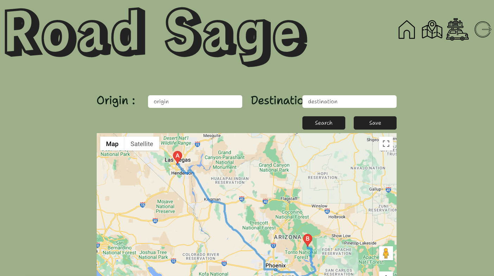
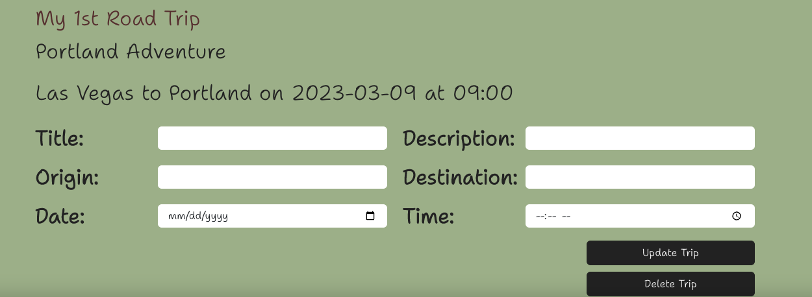

# Road Sage

## Description
Road Sage is a road trip planning application where you can create an account, log-in, use our search map feature to input your destination and it will map the route and save all your trip information to your account. This is a React app built using MongoDG, Node.js, Express.js, GraphQL, Apollo and JWT. 

## Table of Contents

- [Installation](#installation)
- [Usage](#usage)
- [Deployed](#deployed)
- [License](#license)
- [Credits](#credits)

## Installation
After you clone repository:
- Run `npm install` in your terminal. This will install all the dependencies and client & server. 
- Next, run `npm start` to start the client, server and deploy the application. 

## Usage 

Homepage: This is the Roadsage Homepage where you can use the menu to login, navigate to search maps and view your saved trips.

Search Maps: This page you can enter your trip origin and destination to map your trip and get directions. When you click the save button, your trip will be saved to your My Trips page.

My Trips: This is where you can save all your trip information. 

## Deployed
Road Sage has been deployed using Heroku. Click this [link](https://protected-crag-00303.herokuapp.com/) to use the Roadsage Application.

## License
MIT License. Click the license badge at the top for more license details.

## Credits
The following individuals worked together to create the Roadsage application.

- Eric Asato https://github.com/ejasato 
- Supapun Wichachuai https://github.com/begirlz 
- Annemarie Sheridan https://github.com/WittyInventor
- Ashley Pearson https://github.com/Ashley-Pearson 
- Zack Levin https://github.com/TheRealPlanZ 